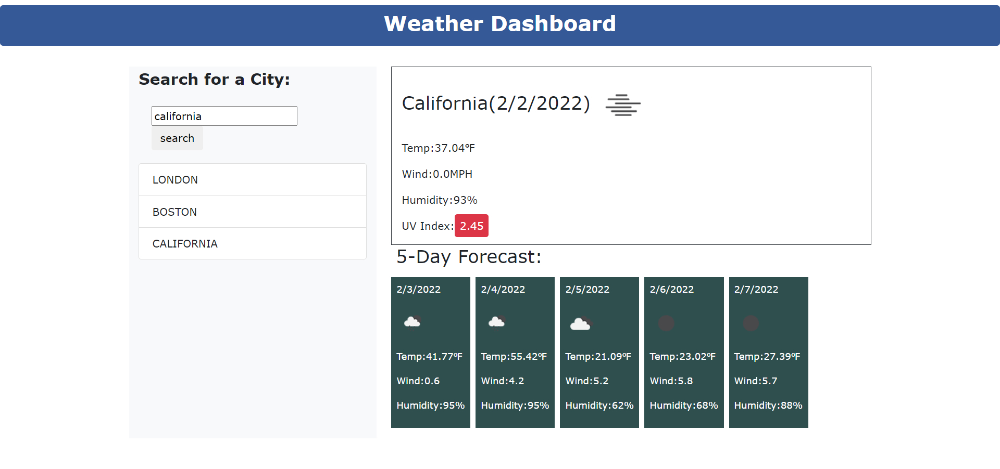

# Weather-Dashboard-repo
 This  weather dashboard retrieve current and future weather data for cities,  will run in the browser and feature dynamically updated HTML and CSS.This app  access the Third-party APIs[OpenWeather One Call API](https://openweathermap.org/api/one-call-api)] which allows developers to access their data and functionality by making requests with specific parameters to a URL. 
 
 ## User Story

```
AS A traveler
I WANT to see the weather outlook for multiple cities
SO THAT I can plan a trip accordingly
```

## Acceptance Criteria

```
GIVEN a weather dashboard with form inputs
WHEN I search for a city
THEN I am presented with current and future conditions for that city and that city is added to the search history
WHEN I view current weather conditions for that city
THEN I am presented with the city name, the date, an icon representation of weather conditions, the temperature, the humidity, the wind speed, and the UV index
WHEN I view the UV index
THEN I am presented with a color that indicates whether the conditions are favorable, moderate, or severe
WHEN I view future weather conditions for that city
THEN I am presented with a 5-day forecast that displays the date, an icon representation of weather conditions, the temperature, the wind speed, and the humidity
WHEN I click on a city in the search history
THEN I am again presented with current and future conditions for that city
```

## Mock-Up
The following image shows the web application's appearance and functionality:

 



 
 
 ## API References
 [OpenWeather One Call API](https://openweathermap.org/api/one-call-api)

 
  [Full-Stack Blog on how to use API keys](https://coding-boot-camp.github.io/full-stack/apis/how-to-use-api-keys).

##
 1  URL of diployed application

 2  URL of github repository